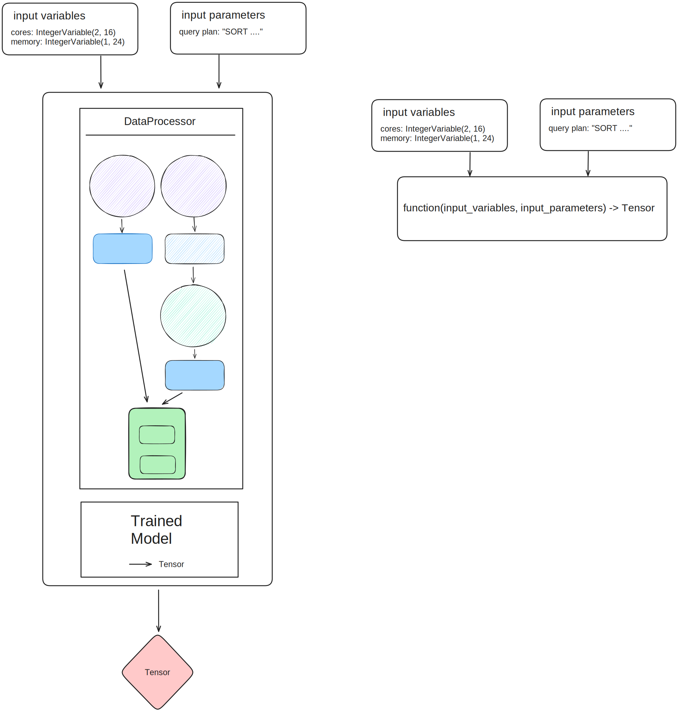
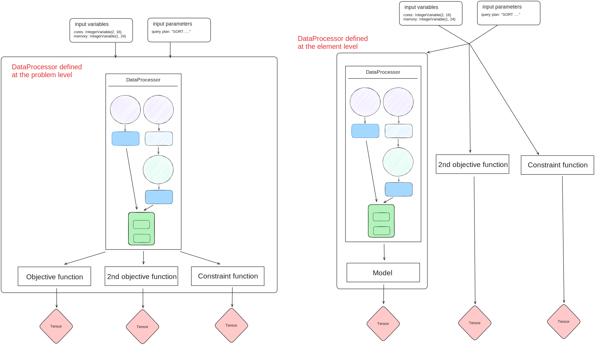

=================================
Defining an optimization element
=================================

In the optimization module, the objectives and constraints are both optimization elements (:py:class:`~udao.optimization.concepts.objective.Objective` inherits from :py:class:`~udao.optimization.concepts.constraint.Constraint`).
They are both callable and have a `function` attribute which defines the function to be optimized or to comply with.

There are two ways to go from a raw variable provided by the user to an objective value:

* For a trained model (left in diagram below), the user can provide a :py:class:`~udao.data.handler.data_processor.DataProcessor` to process the raw variable in the same way as the training data, and a model (implementing `torch.nn.Module <https://pytorch.org/docs/stable/generated/torch.nn.Module.html>`_) to compute the objective value.
* Otherwise (right below), the user can provide a function that takes the raw variable as input and returns the objective value. This function is then wrapped in a :py:class:`~udao.optimization.concepts.objective.Objective` object. In that case, the signature of the functino should fit the :py:class:`~udao.optimization.concepts.utils.UdaoFunction` signature, with two parameters: `input_variables` and `input_parameters`.

In the case a :py:class:`~udao.data.handler.data_processor.DataProcessor` is provided, it can be taken into account in two ways:

* At the problem level, being a preprocessing step for all the objectives and constraints. In that case, the :py:class:`~udao.data.handler.data_processor.DataProcessor` is provided to the :py:class:`~udao.optimization.concepts.problem.BaseProblem` object.
* At the objective level, being a preprocessing step for this objective only. In that case, the :py:class:`~udao.data.handler.data_processor.DataProcessor` is bundled with the model in a :py:class:`~udao.optimization.concepts.utils.ModelComponent` object. This is useful when some functions require a data processor but others do not. However, it is not possible to use this method for gradient descent methods, as will be explained in :doc:`mogd`.

